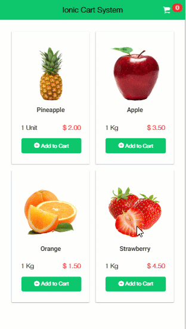

# Ionic Cart Mangement System

Ionic cart system is a program which shows how we create cart management system using Ionic3. In this, we show different functionality like add products to cart, increment, and decrement product quantity, delete the product quantity from the cart, show item count in cart. In this tutorial, we using static function &amp; static cart list to perform all this operation. 

There is also another method of building a cart system using providers. Why I make is cart static because you can call addtocart function also from another page.

## Features: 

1. Add Items to Cart
2. Increment & Decrement Product Quantity
3. Delete Product from cart
4. Validation if Product is already in Cart.
5. Calculate all cart Data.

Built with Ionic 3.

Donate : paypal.me/ajayrandhawa
